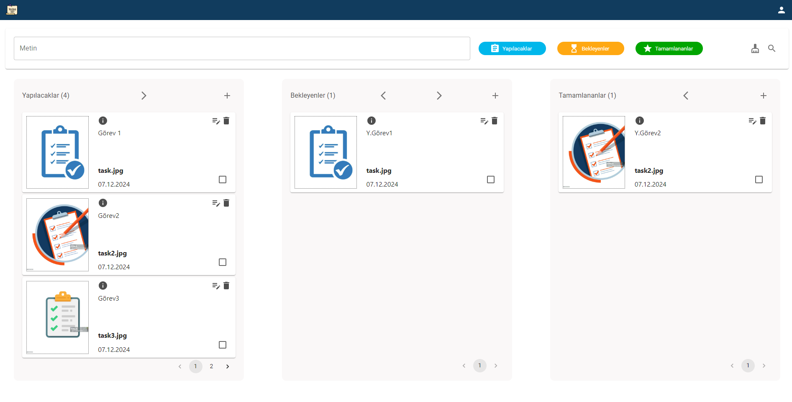

# Todo Uygulaması

Bu proje, modern web teknolojileri kullanılarak geliştirilmiş bir todo (yapılacaklar listesi) uygulamasıdır. Kullanıcı kimlik doğrulama sistemi, todo ekleme, düzenleme, silme, filtreleme ve etiketleme gibi özelliklerle verimli bir görev yönetimi sunar.

---

## İçindekiler

- [Özellikler](#özellikler)
    - [Genel](#genel)
    - [Frontend](#frontend)
    - [Backend](#backend)
- [Teknolojiler](#teknolojiler)
    - [Frontend](#frontend-1)
    - [Backend](#backend-1)
- [Kurulum](#kurulum)
    - [Gereksinimler](#gereksinimler)
    - [Depoyu Klonlayın](#depoyu-klonlayın)
    - [Bağımlılıkları Yükleyin](#bağımlılıkları-yükleyin)
    - [Ortam Değişkenlerini Ayarlayın](#ortam-değişkenlerini-ayarlayın)
    - [Uygulamayı Başlatın](#uygulamayı-başlatın)
- [API Dokümantasyonu](#api-dokümantasyonu)
- [Kullanım](#kullanım)
- [Lisans](#lisans)
- [İletişim](#iletişim)

---

## Özellikler

### Genel
- 🔐 *Kullanıcı Kimlik Doğrulama Sistemi:* Güvenli giriş ve kayıt işlemleri.
- 📝 *Todo Ekleme, Düzenleme ve Silme:* Kolay görev yönetimi.
- 🏷️ *Kullanıcı özelinde task dosyalarının depolanması:* Eklenmiş task dosyaları, backend üzerinde kullanıcı id'lerine göre depolanır.
- 🎯 *Todo Durumlarını Takip Etme:* Yapılacak, Bekleyen ve Tamamlanan görevler.
- 📱 *Responsive Tasarım:* Her cihazda uyumlu arayüz.
- 🌈 *Modern ve Kullanıcı Dostu Arayüz:* Kullanımı kolay ve estetik tasarım.
- 🔍 *Todo'ları Filtreleme ve Arama:* Görevleri hızlıca bulma.
- 🏷️ *Todo'ları Etiketleme Sistemi:* Görevleri kategorilere ayırma.

### Frontend
- *TypeScript* ile geliştirilmiştir, tip güvenliği ve sürdürülebilirlik sağlar.
- *React Router* kullanılarak yönlendirme işlemleri yönetilir.
- *Material-UI (MUI)* ile şık ve özelleştirilebilir bileşenler.
- *Axios* ile API istekleri.
- *JS-Cookie* ile çerez yönetimi.

### Backend
- *Node.js* ve *Express.js* ile geliştirilmiştir, hızlı ve ölçeklenebilir bir backend yapısı sunar.
- *MongoDB* ile veri depolama.
- *JWT Authentication* ile güvenli kullanıcı doğrulama.
- *Bcrypt* ile şifreleme.
- *Mongoose* ile MongoDB veritabanı yönetimi.

## Teknolojiler

### Frontend
- [React](https://reactjs.org/)
- [TypeScript](https://www.typescriptlang.org/)
- [Material-UI (MUI)](https://mui.com/)
- [Axios](https://axios-http.com/)
- [React Router](https://reactrouter.com/)
- [JS-Cookie](https://github.com/js-cookie/js-cookie)

### Backend
- [Node.js](https://nodejs.org/)
- [Express.js](https://expressjs.com/)
- [MongoDB](https://www.mongodb.com/)
- [JWT Authentication](https://jwt.io/)
- [Bcrypt](https://github.com/kelektiv/node.bcrypt.js)
- [Mongoose](https://mongoosejs.com/)

### Gereksinimler
1. Bilgisayarınıza [Node.js](https://nodejs.org) kurulu olmalıdır.
2. [MongoDB](https://www.mongodb.com) kurulumu yapılmış ve çalışır durumda olmalıdır.

## Kurulum
- Depoyu Klonlayın.
  `git clone https://github.com/zehranurozcalisir/to-do-app.git`
  `cd to-do-app`
  `npm install`

- Frontend bağımlılıklarını yükleyin.
  `cd frontend`
  `npm install`

- Backend bağımlılıklarını yükleyin.
  `cd backend`
  `npm install`

- Gerekli ortam değişkenlerini ayarlayın.
- Backend klasörüne gidip .env dosyası oluşturun.
  `cd backend`
  `touch .env`
- Sonrasında paylaştığım sample.env dosyasının içeriğini .env dosyasına kopyalayın.

## API Dokümantasyonu
- API Bilgileri Postman Collection'da mevcuttur.

# Uygulamayı başlatın
## Frontend'i başlatın
`cd frontend`
`npm start`

## Backend'i başlatın (yeni bir terminal penceresinde)
`cd backend`
`node app.js`

## Okunması Gerekenler
1. Giriş yapın.
2. **kullanıcı adı**: zehra  **şifre**: 1234
3. Navbar'ın sağ köşesinde bulunan **Hesap** ikonunu kullanarak, kullanıcı ekleyebilir veya çıkış yapabilirsiniz.
4. Ana sayfada todo'larınızı görüntüleyin.
5. Metin bölümündeki alanı kullanarak istediğiniz içeriği filtreleyip bulabilirsiniz. Bu özelliği
   kullanabilmek için **Metin** alanına aramak istediğiniz metni yazıp, sonrasında **Filtrele** butonuna basabilirsiniz.
6. Filtreleri sıfırlamak için, **Filtrele** butonu'nun solundaki **Temizle** butonunu kullanabilirsiniz.
7. Sayfa'da 3 farklı etiket bulunmaktadır. Bunlar; **Yapılacaklar**, **Bekleyenler**, **Tamamlananlar**.
   Bu 3 farklı etiketi Metin arama kısmının sağ tarafından seçebilir ve istediğiniz etiketlerin todo'larını görüntüleyebilirsiniz.
   Etiketleri **pasif duruma** getirebilmek için istediğiniz etiketin butonuna tıklamanız yeterlidir.
8. 1 Etiket bölümünde en fazla 3 task görebilirsiniz. Eğer 3'den fazla taskı eklediyseniz pagination kısmını kullanarak diğer taskları da görüntüleyebilirsiniz.
9. Her task üzerinde işlem yapabilmek için ikonlar bulunuyor. Bu ikonların kullanımı şu şekildedir;
- **i(info)**: Bu ikonu kullanarak task'ın içeriğini daha geniş ve detaylı bir biçimde görüntüleyebilirsiniz.
- **Sil(Trash)**: Bu ikonu kullanarak istediğiniz task'ı silebilirsiniz.
- **Düzenle(Edit)**: Bu ikonu kullanarak taskınızın bilgilerini ve etiketini düzenleyip, güncelleyebilirsiniz.
9. Etiketleri kendi üzerindeki checkbox'ları kullanarak, Etiket durumunu yukarıdaki Ok'lar ile birlikte kullanarak güncelleyebilirsiniz.
